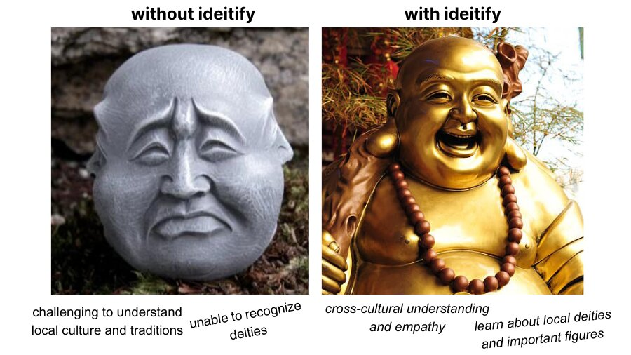
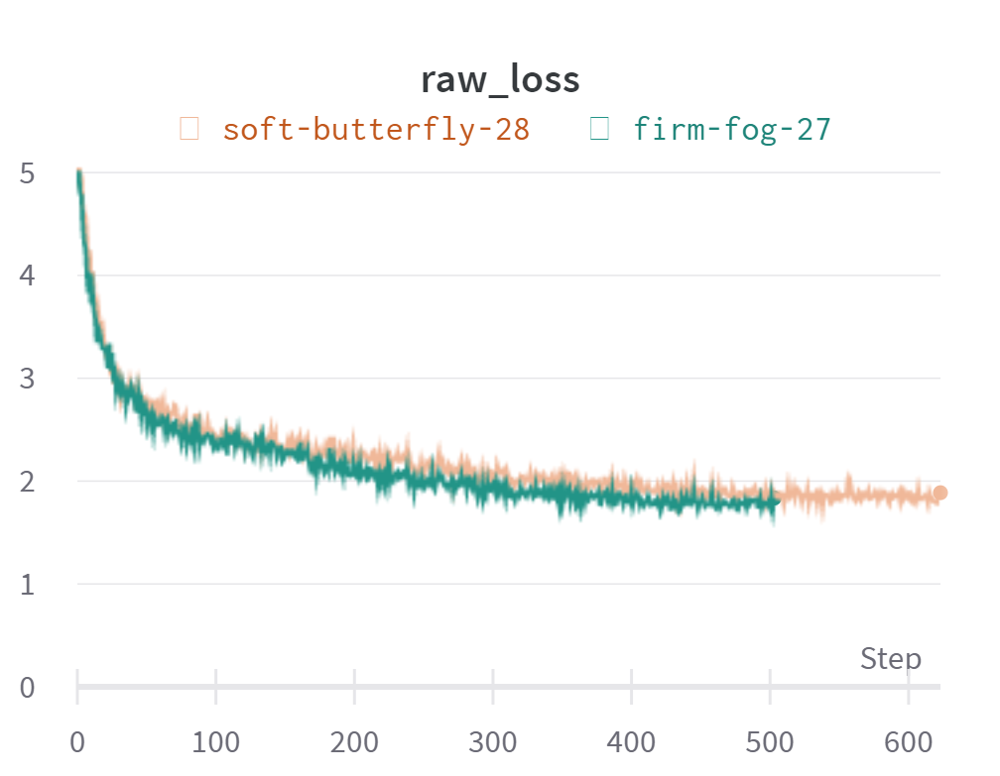
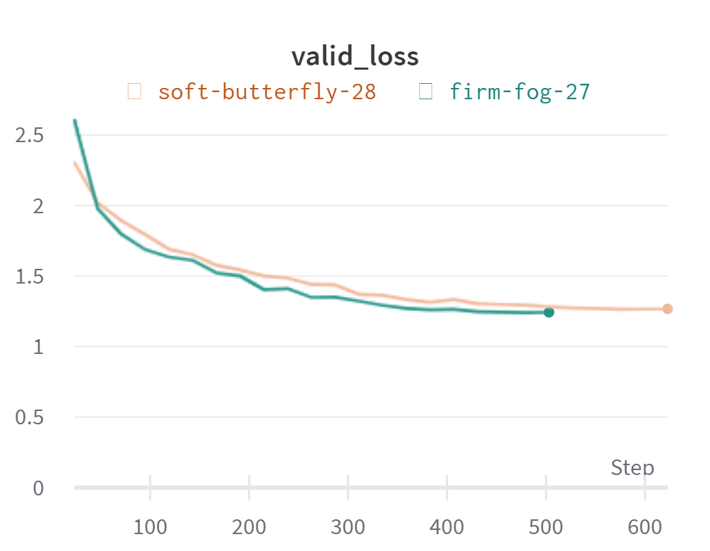
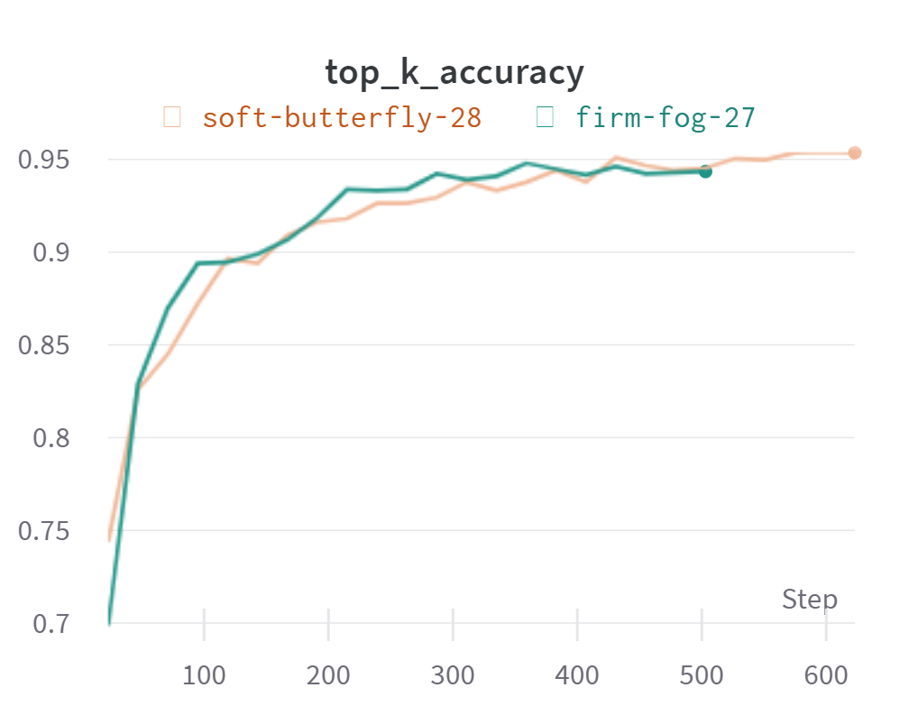
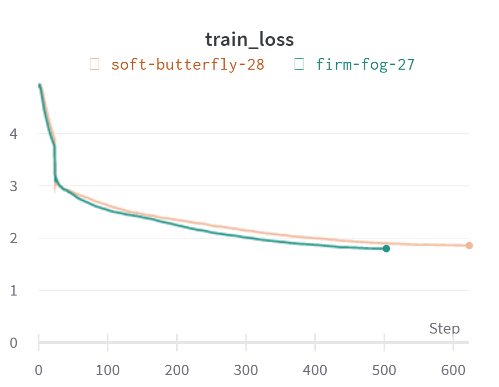
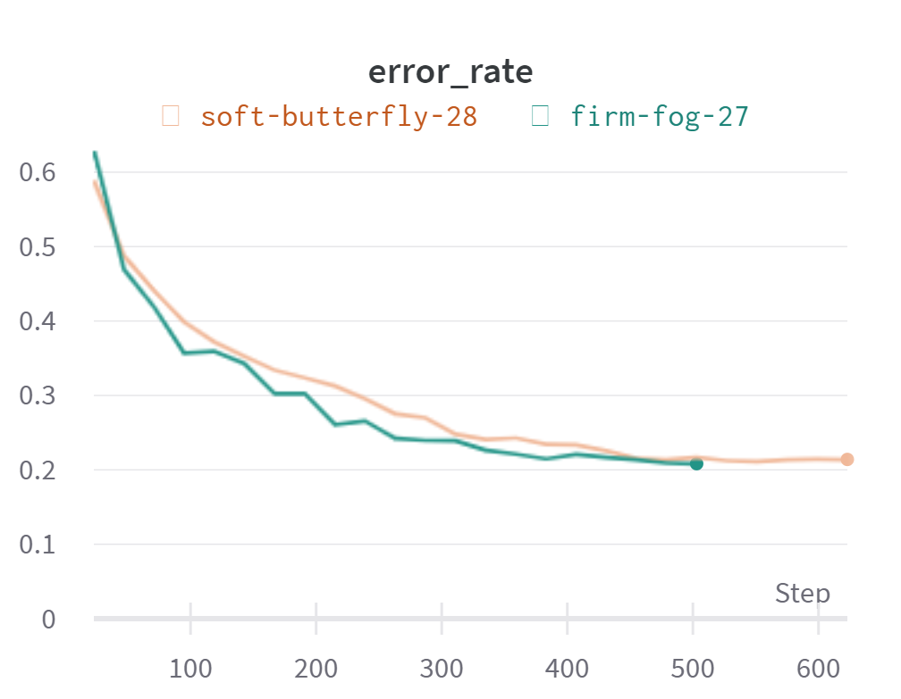
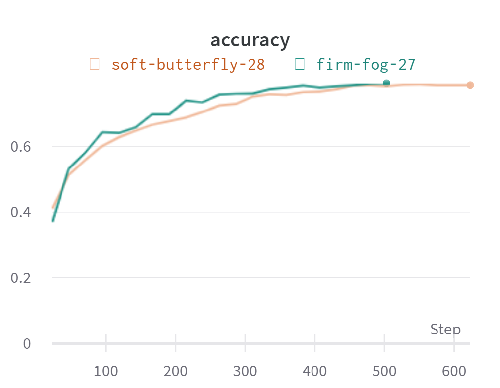

# Ideitify

 

Identifying deities and their iconography is often challenging for people who are not familiar with the specific cultural or religious traditions. 
Many deities have unique visual representations, and understanding the symbolism behind them can be crucial to fully appreciating their significance. 

Ideitify is a computer vision system that is intended to accurately recognize and classify deities. It could provide a valuable tool for travelers and 
tourists seeking to deepen their understanding and appreciation of different cultures. Additionally, this project could have applications in education, 
art history, and cultural preservation.

<strong>End goal</strong>: take a snap and learn about the deity (historical background, symbols, festivals etc). The model is required to classify deities from various traditions and cultures around the globe.

### Current Stats

| Metric  | Value |
|-----------|----------|
|<strong>top-1-accuracy</strong>| 78.79% |
|<strong>top-3-accuracy</strong>| 91.11% |
|<strong>top-5-accuracy</strong> | 94.98% 

### Wandb Report

      
     

## What's in this repo?

* `notebooks/` - folder with all the experiments. <code>putting-it-all-together.ipynb</code> is the training notebook adapted from this [script](https://github.com/tcapelle/fastai_timm/blob/main/fine_tune.py).
* `Google-Image-Scraper/` - cloned [repo](https://github.com/ohyicong/Google-Image-Scraper) for image web scraping. There is an issue with the webdriver version. 
* `prepare_and_push.py` - notebook that finds issues and cleans the image data before pushing it to Kaggle.
* `visualize.ipynb` - Image data exploration and analysis.
* `app.py` - Streamlit-powered frontend app that pulls fast.ai learner from huggingface for inference. 
* `requirements.txt` - A text file with the dependency requirements for this project.

## TODOs

- [x] Build a resnet18 baseline model
- [x] Experiment with preprocessing and training tricks
- [x] Put together a training notebook
- [x] Integrate wandb for tracking experiments
- [x] Data preparation pipeline
- [x] Write a basic streamlit frontend app
- [ ] Automate the image collection workflow
- [ ] Experiment with GANs and Diffusers to generate synthetic images
- [ ] Implement Test Time Augmentation method for inference
- [ ] Refine the dataset and push it to huggingface hub
- [ ] Expand the dataset to include cultures such as African, Roman, Shinto, and Chinese.
- [ ] Figure out how to handle images that do not have any detity
- [ ] Write better explainers + make beautiful diagrams + make blog posts.

## Acknowledgements

I have some experience in training basic deep learning models, but I have always used pre-existing data from Kaggle and other sources. I started this project to gain practical experience in the entire deep learning life cycle, including data collection and model deployment. I chose Fastai as my framework because of its simple API, which allows me to concentrate on other aspects of the project, such as data curation and processing.

Jeremy Howard's series on Deep Learning are invaluable: [Practical Deep Learning for Coders 2022](https://www.youtube.com/watch?v=8SF_h3xF3cE). Fastai [book](https://github.com/fastai/fastbook) is also instrumental in my learning journey, providing me with valuable insights and knowledge. 

Jeremy Howard's Road to the Top series was another essential resource for me, and I found the accompanying notebooks to be extremely helpful. 
* [First Steps: Road to the Top, Part 1](https://www.kaggle.com/code/jhoward/first-steps-road-to-the-top-part-1#Our-first-model) 
* [Small models: Road to the Top, Part 2](https://www.kaggle.com/code/jhoward/small-models-road-to-the-top-part-2) 
* [Scaling Up: Road to the Top, Part 3](https://www.kaggle.com/code/jhoward/scaling-up-road-to-the-top-part-3) 
* [Multi-target: Road to the Top, Part 4](https://www.kaggle.com/code/jhoward/multi-target-road-to-the-top-part-4)

### Note: Ideitfy is a work in progress. 

This project serves as both an educational resource and a personal learning experience for me. I welcome any feedback, suggestions, or bug reports that you may have.
